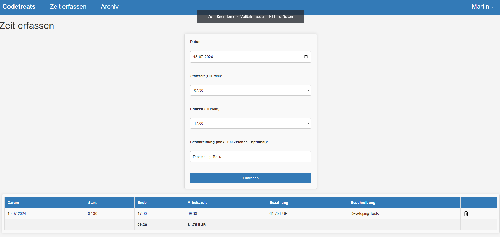
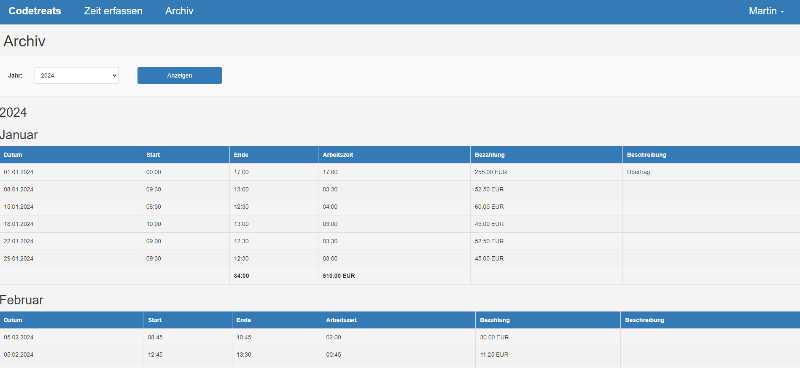
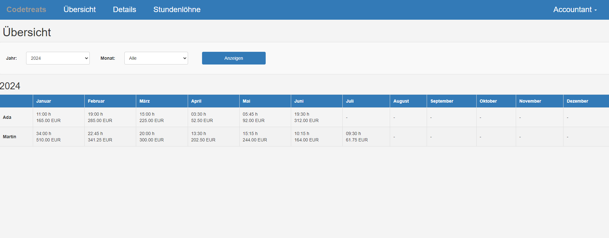
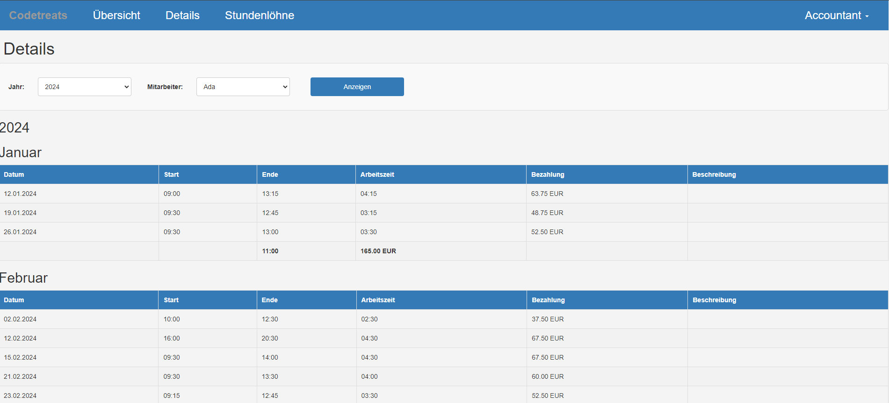

# Codetreats Time-Recording

codetreats\time-recording is a simple tool for time recording in small componaies or organisations.

## User Roles

It has two major users roles:

* Staff
* Accountant

### Staff

Staff users can track their working times and can modify the current month:

Furthermore they can monitor their old records:

### Accountant

As an accountant you can have an overview of the current year:

Have a detail view of each user:

Or change the salary of a user:

## Usage

Please refer to [Usage.md](USAGE.md)

## Language

You can switch the language by editing the file `i18n/_load.php`

